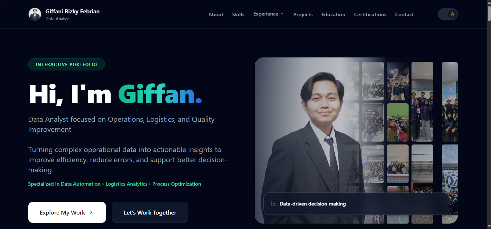

# 👋 Hi, I'm Giffani Rizky Febrian

🎯 **Data Analyst focused on Operations, Logistics, and Process Improvement**

I specialize in transforming complex operational data into structured insights that improve efficiency, reduce errors, and support better decision-making.

---

## 🌐 Live Portfolio
👉 https://your-portfolio.vercel.app

---

## 🧠 About This Project

This portfolio is built as a **data-driven personal platform** to showcase:

- Analytical thinking
- Real-world project experience
- Data automation and workflow optimization
- Professional storytelling through structured UI

The design emphasizes clarity, performance, and modern interaction patterns inspired by enterprise-level dashboards and corporate campaign websites.

---

## ⚙️ Tech Stack

- **Framework**: Next.js
- **Language**: TypeScript
- **Styling**: Tailwind CSS
- **Animation**: Framer Motion
- **Deployment**: Vercel

---

## ✨ Key Features

- 🎨 Modern responsive UI (desktop-first, mobile-ready)
- ⚡ Smooth animations & interaction design
- 📊 Data-focused storytelling structure
- 🧩 Modular component-based architecture
- 🌙 Dark mode support
- 📬 Functional contact form (Formspree integration)

---

## 📂 Project Structure
src/
├── app/
├── components/
├── sections/
└── data/

---

## 📈 Highlights

- Built with a **system thinking approach** to reflect real-world analytics workflows
- Designed for **recruiter readability** and fast information scanning
- Combines **technical depth + professional presentation**

---

## 📬 Contact

- LinkedIn: https://linkedin.com/in/giffanifebrian
- Email: giffaniriz25@gmail.com

---

## 📝 Notes

This project is continuously improved as part of my learning journey in data analytics, automation, and system design.

---

## ⭐ If you find this interesting

Feel free to explore, fork, or connect with me!
